# ML-DevOps

MLOps (a compound of “machine learning” and “operations”) is a practice for collaboration and communication between data scientists and operations professionals to help manage production ML (or deep learning) lifecycle.

<h2>This is the integration of ML and DevOps forming MLOPs</h2>

Well to achieve that we need to do some tasks:
<ol>
  <li><em>Create a docker image  that will have all the required libraries to run models</em>.This is needed to be done using Dockerfile...
   
   
   
   These are contents in the Dockerfile....
                       
                       FROM centos

                      RUN yum install python3 -y

                      RUN pip3 install --upgrade pip

                      RUN pip3 install keras

                      RUN pip3 install tensorflow

                      RUN pip3 install numpy 

                      RUN pip3 install pandas

                      RUN pip3 install scipy

                      RUN pip3 install opencv-python

                      RUN pip3 install sklearn 
   
   Then after the Dockerfile created we need to build the image..
   
   
   In my case, I have used....
   
  </li>
  <li>Running the image will actually run the model and go for the accuracy..</li>
  
    
  <h4>A series of Jenkins Job needs to be done to achieve this automation....</h4>
  
  <ul>
  <li><h2>First Job</h2>
    Description:- This Job will  actually pull all the files from GitHub Repo and save it in the BaseOS
    
  1.   
  
  
  2.   
    
  3.   
  
  4. 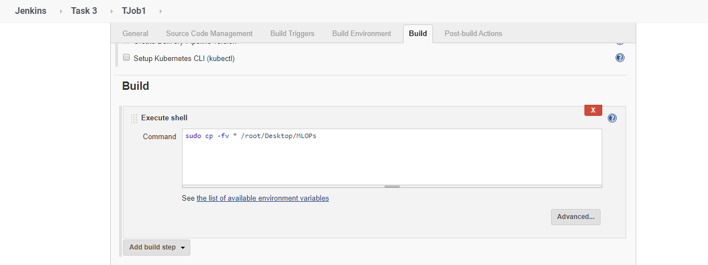  
  
  5. 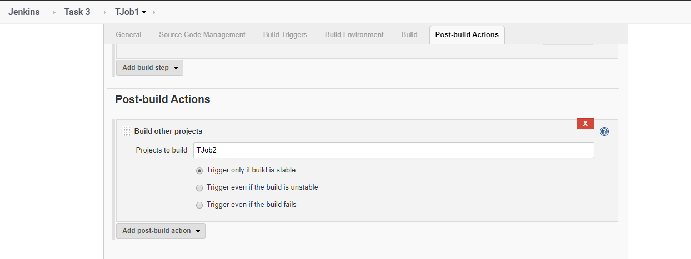  
  
  </li>
  
  This job will activate via token...I have used the curl command in the post-commit in the local GitHub Repository...
  
  
  
  <li><h2>Second Job</h2>
    Description:- This job will handle the detection part that will help us to run images based on the type of model..
    
   1. 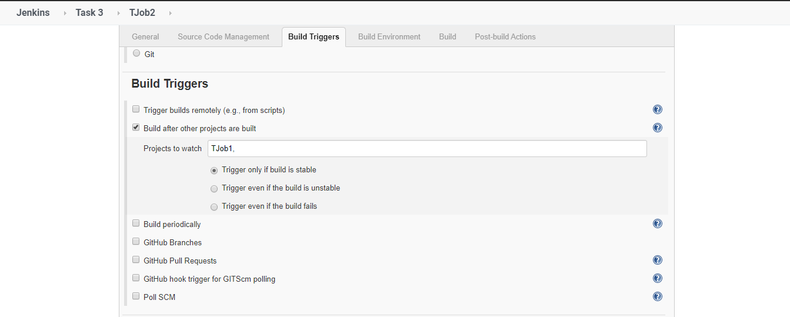  
   
   2.   
   
                            if sudo cat /root/Desktop/MLOPs/main.py | grep keras
                            then
                            if sudo docker ps -a | grep nn
                            then 
                            sudo docker rm -f nn
                            echo "Hello"
                            fi
                            echo "Keras Model Created"
                            sudo docker run -dit -v /root/Desktop/MLOPs:/home --name nn name:MLOPS
                            elif sudo cat /root/Desktop/MLOPs/main.py | grep sklearn
                            then 
                            if sudo docker ps -a | grep sk
                            then 
                            sudo docker rm -f sk
                            fi
                            echo "Sklearn Model Created"
                            sudo docker run -dit -v /root/Desktop/MLOPs:/home --name sk name:MLOPS
                            fi
      </li>
   <li><h2>Third Job</h2>
  This Job will be used for appending some set of lines that will help us with finding the accuracy...
  This file will help us keep a check in the accuracy..

  
   
   
          import os
          acc=acc*100
          if int(acc) > 80:
            os.system('curl --user "admin:toor" http://192.168.1.105:8080/view/Task%203/job/success/build?token=success')
          else:
            os.system('curl --user "admin:toor" http://192.168.1.105:8080/view/Task%203/job/Failure/build?token=Fail')
            
   And for the Job section....
   
   1.    
   
   2.   
   
   3.   
   
   This will now create a new file named "main1.py " that will contain the code given by the developer and also the code in the append file...
   
   </li>
   <li><h2>Fourth Job</h2>
  Decsription:- This job will run the model to find the first accuracy aquired...
  
   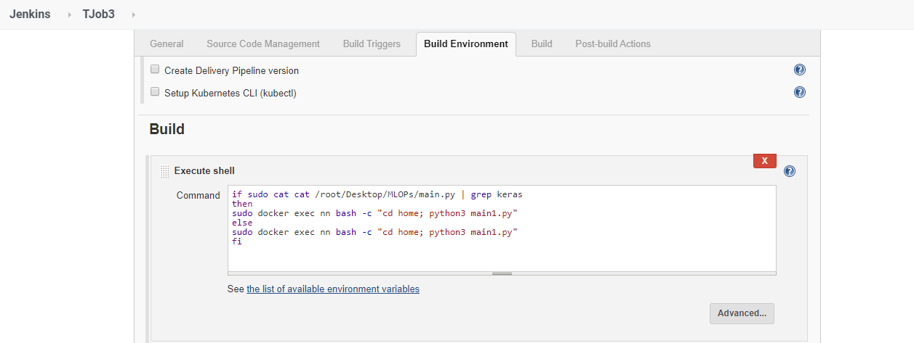
   
                      if sudo cat cat /root/Desktop/MLOPs/main.py | grep keras
                      then 
                      sudo docker exec nn bash -c "cd home; python3 main1.py"
                      else
                      sudo docker exec nn bash -c "cd home; python3 main1.py"
                      fi
</li>

<li><h2>Fourth Job</h2>
  This is the job that will handle the email sending part if the model needs to be trained..
  The code for that is.........
  
        import smtplib
      from email.message import EmailMessage

      sender_mail="shoumiksahu2000@gmail.com"
      rec_mail="sahushoumik23@gmail.com"
      password="Testing2000"
      msg = EmailMessage()
      msg.set_content('The model you sent is not having above 80%  accuracy, so we are modifying it for you...\n\nThank   You,\nJenkins,\nDevOps.')

      msg['Subject'] = 'Model is not very accurate 2 '
      msg['From'] = sender_mail
      msg['To'] = rec_mail

      # Send the message via our own SMTP server.
      server = smtplib.SMTP_SSL('smtp.gmail.com', 465)
      server.login(sender_mail,password)
      print("Login Success")
      server.send_message(msg)
      print("Email has been sent to ",rec_mail)
      server.quit()
 
This python code is stored in the file named "Failure.py"
The job section to this part is .....

1. 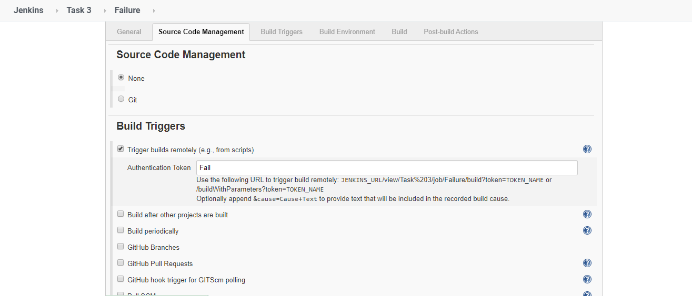

2. 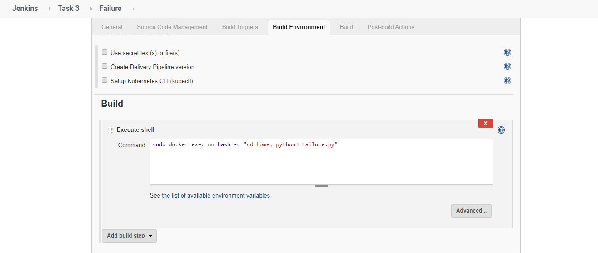
      
        sudo docker exec nn bash -c "cd home; python3 Failure.py"

3. 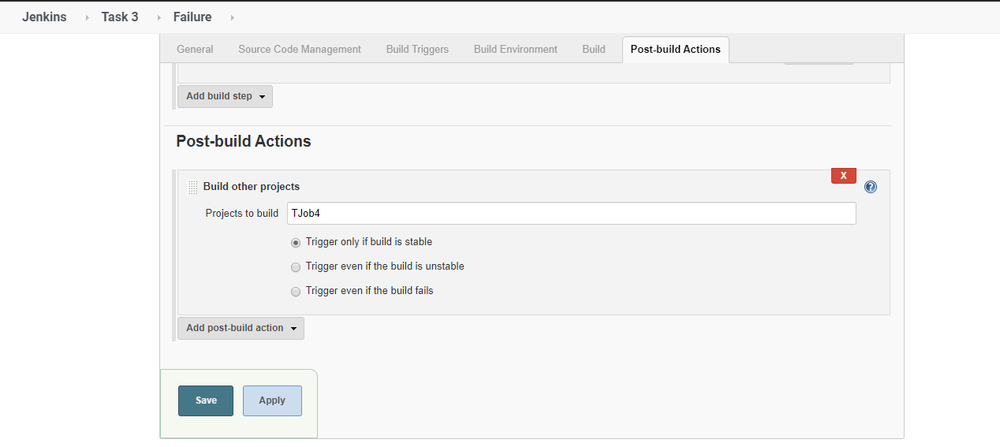
</li>

<li><h2>Fifth Job</h2>
  Decsription:- This job is responsible to run the program that will actually increase the accuracy to the desired mark...
  
  I have made the Accuracy.py file to do the accuracy increasing part...
  
 As for the job,
 
 1. 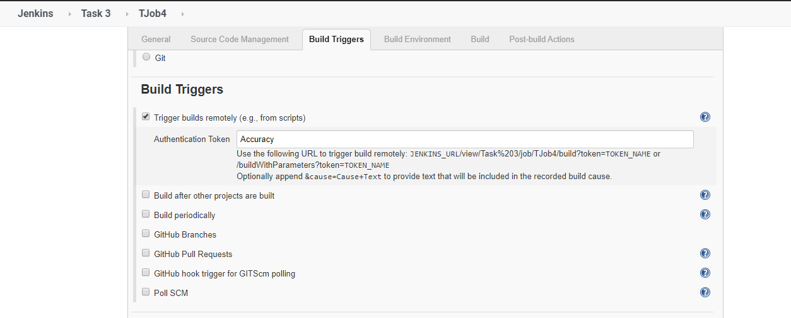  
 
 2. 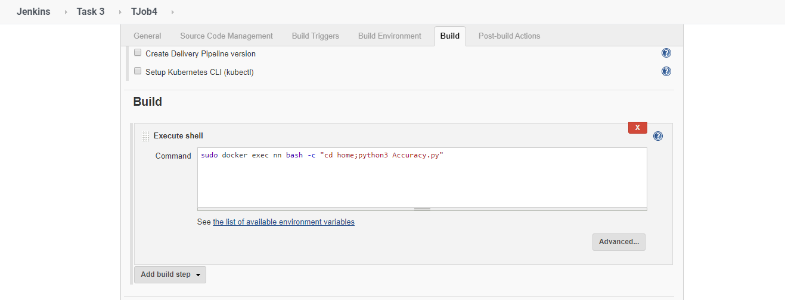  
 
 3. 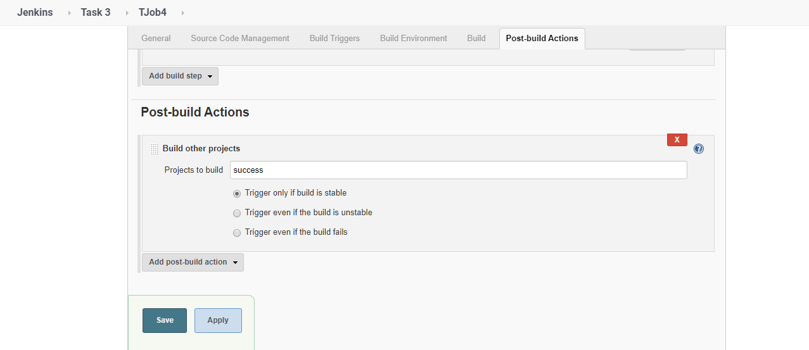  
 
 </li>
 
 <li><h2>Sixth Job</h2>
   Description:- This part of the job is to send an email informing the developer that the model has been successfully tweaked to the desired Mark.
  
  The python code for that is...
  
          import smtplib
          from email.message import EmailMessage

          sender_mail="shoumiksahu2000@gmail.com"
          rec_mail="sahushoumik23@gmail.com"
          password="Testing2000"
          msg = EmailMessage()
          msg.set_content('The model has been sucessfully tweaked to 80% accuracy...\n Congo....')

          msg['Subject'] = 'Model trainig Complete'
          msg['From'] = sender_mail
          msg['To'] = rec_mail

          # Send the message via our own SMTP server.
          server = smtplib.SMTP_SSL('smtp.gmail.com', 465)
          server.login(sender_mail,password)
          print("Login Success")
          server.send_message(msg)
          print("Email has been sent to ",rec_mail)
          server.quit()
 
  Now the job will just run this code to inform that the model has been tweaked and then will just push the whole thing back to the GitHub Repo...
  
  1. 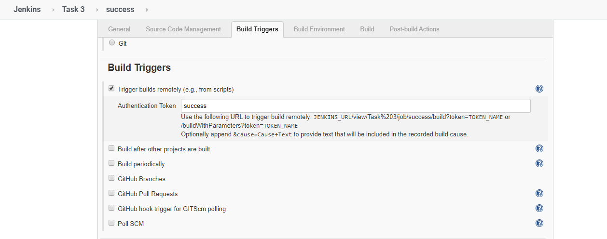  
  
  2.   
  
          sudo docker exec nn bash -c "cd home;python3 Success.py"
  
  3. 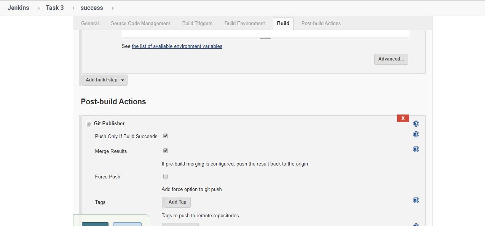  
  
  </li>
  
  <li><h2>Seventh job</h2>
  Decription:- This Job acts as a monitor that will just simply restart the model training from where it left if due to any chance the build stops....
  
  1.   
  
  2. 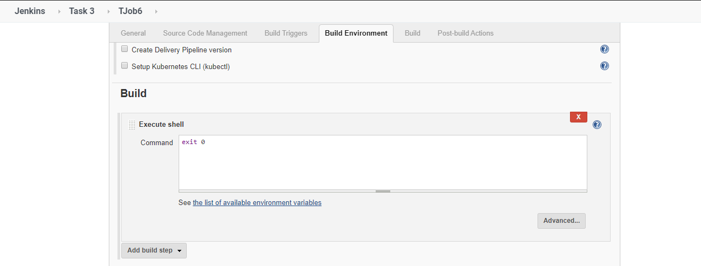  

  3. 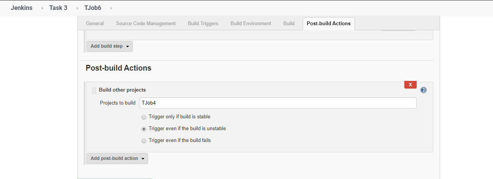  
</li>
  

   
   
   
   
   
    With all these you will achieve a fully automated system that will have all the required stuffs to self train the model to increase the accuracy of the model...

    Feel free to contact me if you have any doubt in the project ...

     Contact me via Whatsapp:9338455463(No calls plzzz)

     You can also contact via LinkedIn :(www.linkedin.com/in/shoumik-sahu-3b5631188)

     Thank you..

   
   

  
